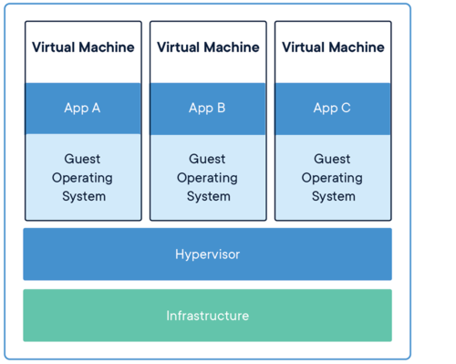

## What is a container?

In short, a container is a lightweight Linux kernel plus some other stuffs (packages, libraries, executables, etc) that performs a specific task(s). Containers are created to make maintaining and running software easier, but could be also used to make scientific research reproducible.

-   A container is a standard unit of software that packages up code and
    all its dependencies so the application runs quickly and reliably
    from one computing environment to another.
-   Containers allow a developer to package up an application with all
    of the parts it needs, such as libraries and other dependencies, and
    ship it all out as one package.
-   Multiple containers can run on the same machine and share the OS
    kernel with other containers, each running as isolated processes in
    user space, hence are *lightweight* and have *low overhead*.
-   Containers ensure *portability* and *reproducibility* by isolating
    the application from environment.

How is a Container Different from a VM?
---------------------------------------

Virtual machines enable application and resource isolation, run on top
of a hypervisor (high overhead). Multiple VMs can run on the same
physical infrastructure - from a few to dozens depending on resources.
VMs take up more disk space and have long start up times (\~minutes).



Containers enable application and resource isolation, run on top of the
host operating system. Many containers can run on the same physical
infrastructure -up to 1,000s depending on resources. Containers take up
less disk space than VMs and have very short start up times (\~100s of
ms).


For an in-depth explanation see: 

[OS-level virtualization](https://en.wikipedia.org/wiki/OS-level_virtualization).

For some enterprise viewpoints see:

[Docker](https://www.docker.com/resources/what-container/)

[IBM](https://www.ibm.com/cloud/blog/containers-vs-vms)

[Microsoft](https://azure.microsoft.com/en-us/overview/what-is-a-container/)

[Redhat](https://www.redhat.com/en/topics/containers)


Container Technologies
----------------------

### Docker


Docker is a containerization platform that uses OS-level virtualization
to package software and dependencies in deliverable units called
containers. It is by far the most common containerization platform
today, and most other container platforms are compatible with Docker.
(E.g. Singularity and Shifter are two containerization platforms you\'ll
find in HPC environments).

### Installing docker

##### Going around blocking of Iran's IP

Unfortunately docker restricts its service for Iran. So you need a workaround. You can use VPN or some other services like [Shekan](https://shecan.ir/) to install docker and use [dockerhub](https://hub.docker.com/). For more information, see [its FAQ](https://shecan.ir/faq/).

##### Installation steps

Depending on your OS and distro, you can install docker. If you use Gnu/Linux, please install [docker server](https://docs.docker.com/engine/install/) according to the documentation for your platform. If you have Mac or Windows, please install [docker desktop](https://docs.docker.com/get-docker/).

### Singularity (now Apptainer)

Singularity (recently renamed as Apptainer) is a container solution
designed to execute applications at bare-metal performance while being
secure, portable, and 100% reproducible. Singularity\'s permissions
model makes it a popular choice for shared HPC environments where Docker
cannot be supported. It has its own syntax for building containers but
also support pulling and running Docker containers.

In general we use **Docker** to develop new containers and run them on
our laptops. We use **Singularity (Apptainer)** as a runtime on our HPC
systems. We can find existing containers that are compatible with both
Docker and Singularity (Apptainer) platforms (among others) at:

1.  [Docker Hub](https://hub.docker.com/)
2.  [Quay.io](https://quay.io/)
3.  [BioContainers](https://biocontainers.pro/#/)

Some Quick Definitions
----------------------

### Dockerfile or Deffile for singularity

A Dockerfile is a recipe for creating a Docker image. It is a
human-readable, plain text file that contains a sequential set of
commands (*a recipe*) for installing and configuring an application and
all of its dependencies. The Docker command line interface is used to
interpret a Dockerfile and \"build\" an image based on those
instructions. Other container build environments, such as Apptainer,
have different syntax for container recipes, but the function is the
same.

### Image

An image is a read-only template that contains all the code,
dependencies, libraries, and supporting files that are required to
launch a container. Docker stores images as layers, and any changes made
to an image are captured by adding new layers. The \"base image\" is the
bottom-most layer that does not depend on any other layer and typically
defines the operating system for the container.

### Container

A container is an instance of an image that can execute a software
enviornment. Running a container requires a container runtime
environment (e.g. Docker, Apptainer) and an instruction set architecture
(e.g. x86) compatible with the image from which the container is
instantiated.

### Image Registry

Docker images can be stored in online image registries, such as [Docker
Hub](https://hub.docker.com/). (It is analogous to the way Git
repositories are stored on GitHub.) Image registries are an excellent
way to publish research software and to discover tools built by others.
Image registries support the notion of tags to identify specific
versions of images.

### Image Tags

Docker supports image tags, similar to tags in a git repository. Tags
identify a specific version of an image. The full name of an image on
Docker Hub is comprised of components separated by slashes. The
components include an \"owner\" (which could be an individual or
organization), the \"name\", and the \"tag\". For example, an image with
the full name

``` {.text}
your_docker_username/your_modified_ubuntu:0.1
```

would reference the \"your_modified_ubuntu\" image owned by \"your_docker_username\"
organization with a tag of \"0.1\".
